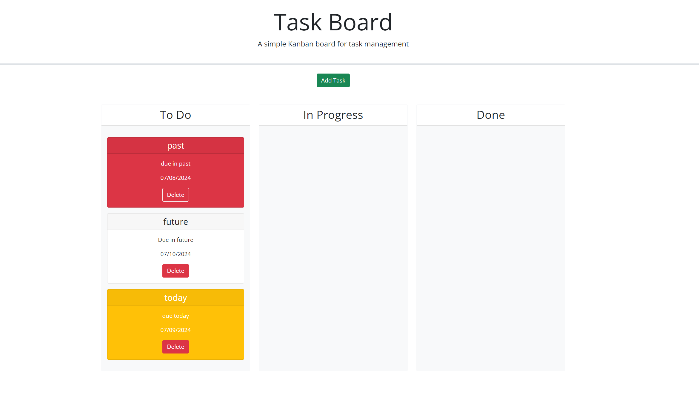
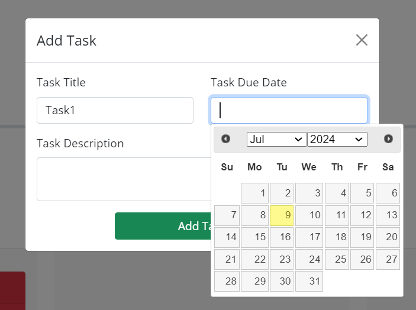
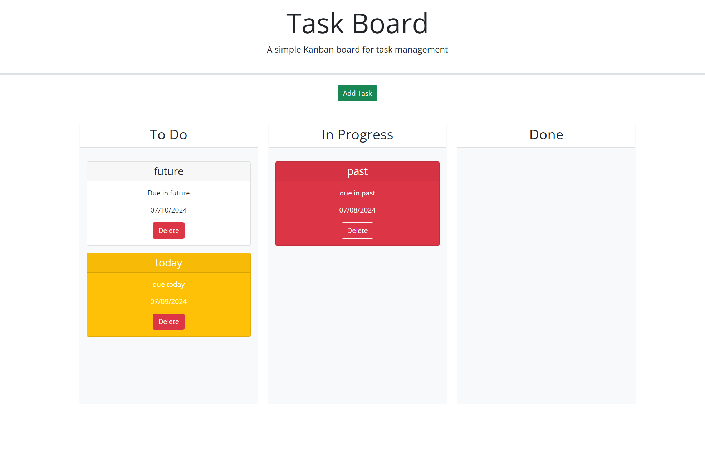

# task-board

## Description

A task board to manage the project tasks.

## Installation

N/A

## Usage

A simple Kanban board to help the team members with task management.

## Screenshots

The following screenshots shows the tasks board's appearance

## Codebase

You can find the project repository [here](https://github.com/shreyareddy6/task-board.git)

You can find the deployed page [here](https://shreyareddy6.github.io/task-board/)

## Credits

Referred to the mini project which helped alot in understanding the requirement.

## License

Please refer to the LICENSE in the repo.
